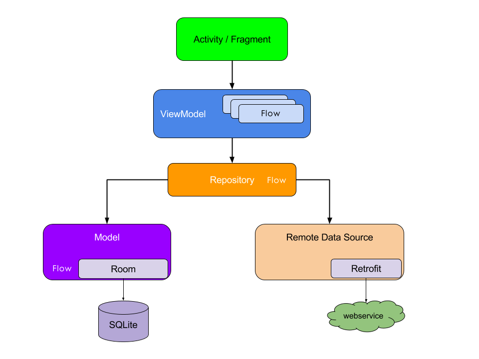
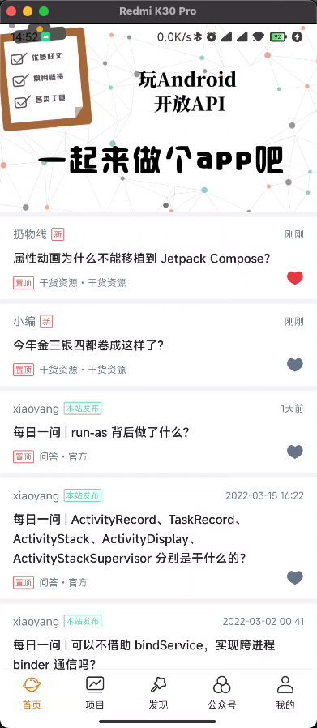
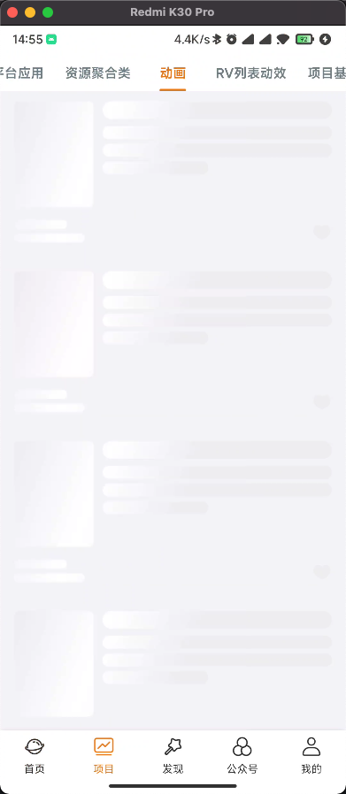
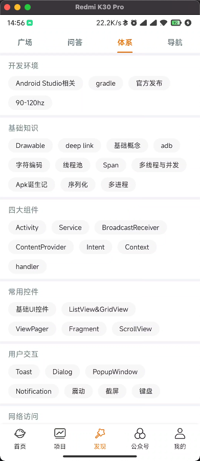
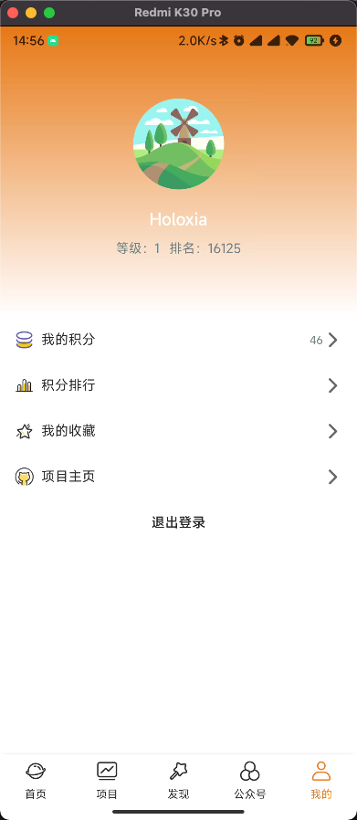

# WanAndroid

本项目为[WanAndroid](https://wanandroid.com/) Kotlin App实现，非常感谢鸿洋大神提供的[WanAndroid开放Api](https://wanandroid.com/blog/show/2)。

主要技术点：`MVVM` `coroutines` `Flow` `Hilt` `Retrofit2` `Coil` `ViewBinding` `hilt` `LifeCycle`

## 学习借鉴Gooogle AAC架构（[architecture-components-samples官方示例](https://github.com/android/architecture-components-samples)）

## 项目预览

| 首页                                                         | 加载视图                                                     |
| ------------------------------------------------------------ | ------------------------------------------------------------ |
|  |  |

| 发现-体系                                          | 我的                                          |
| ------------------------------------------------------------ | ------------------------------------------------------------ |
|  |  |

## TODO

- ROOM本地化存储部分
- 文章详情页收藏、图片放大等
- 切换主题与深色模式适配
- 本项目还有一些不够完善的地方，如发现有Bug，欢迎[issue](https://github.com/HoloXia/WanAndroid/issues)

## 项目中使用的开源库
- [MMKV-基于 mmap 的高性能通用 key-value 组件](https://github.com/Tencent/MMKV/)
- [可定制化阴影的万能阴影布局](https://github.com/lihangleo2/ShadowLayout)
- [基于的 Android WebView ，极度容易使用以及功能强大的库](https://github.com/Justson/AgentWeb)
- [BRVAH-强大而灵活的RecyclerView Adapter](https://github.com/CymChad/BaseRecyclerViewAdapterHelper)
- [基于ViewPager2的Banner控件](https://github.com/youth5201314/banner)
- [点赞View](https://github.com/qkxyjren/LikeView)
- [页面加载缺省页管理](https://github.com/HoloXia/LoadState)
- [Lottie动画](https://github.com/airbnb/lottie-android)

## 参考文章

- [不做跟风党，LiveData，StateFlow，SharedFlow 使用场景对比](https://juejin.cn/post/7007602776502960165)
- [从 LiveData 迁移到 Kotlin 数据流](https://juejin.cn/post/6979008878029570055)

